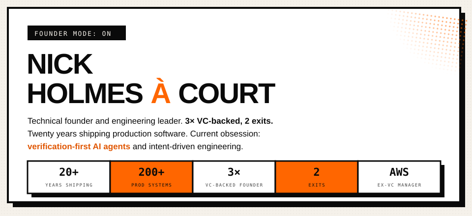

<div align="center">
  
</div>

<p align="center">
  <a href="https://www.linkedin.com/in/nholmesacourt"></a>
  <a href="https://nickhac.substack.com"></a>
  <a href="mailto:nick@altitudegroup.org"></a>
</p>

## ▲ Now Shipping

<table>
  <tr>
    <td width="50%" valign="top">
      <h3><a href="https://nondual.cloud">Nondual.cloud</a></h3>
      <sub><b>AGENT INFRA</b></sub>
      <p>Relationship infrastructure for AI agents: agent identity, intent graphs, and connector patterns so agents remember who they work with and why.</p>
      <p><sub><b>BUILT →</b></sub> Production prototypes plus reusable connector patterns. Founder and lead engineer.</p>
    </td>
    <td width="50%" valign="top">
      <h3><a href="https://gtm-os.xyz">GTM-OS.xyz</a></h3>
      <sub><b>AUTONOMOUS GTM</b></sub>
      <p>An AI agent that runs go-to-market while you sleep: outreach, qualification and analytics pipelines wired into one loop.</p>
      <p><sub><b>BUILT →</b></sub> Repeatable revenue-experiment engine. Product and systems lead.</p>
    </td>
  </tr>
  <tr>
    <td width="50%" valign="top">
      <h3><a href="https://acquireable.club">Acquireable.club</a></h3>
      <sub><b>🏆 HACKATHON WINNER</b></sub>
      <p>Rapid revenue prototype built under event constraints at the SF Hermes Hackathon, Jul 2026.</p>
      <p><sub><b>RESULT →</b></sub> Winner: most revenue generated in cohort. Lead engineer.</p>
    </td>
    <td width="50%" valign="top">
      <h3><a href="https://altitudegroup.org">AltitudeOS</a></h3>
      <sub><b>AGENT FACTORY</b></sub>
      <p>Agentic software factory: structured task briefs, CI for agent workflows, repeatable product delivery.</p>
      <p><sub><b>BUILT →</b></sub> The system that builds the systems. Architect and engineering lead.</p>
    </td>
  </tr>
</table>

## ■ Depth &amp; Currency

| | |
|---|---|
| **ENGINEERING** | Computer Science degree. 20+ years across **Python, JavaScript, C#, SQL**, REST and FastAPI, ETL and BI. Personally shipped and managed **200+ production systems**: multi-tier, cloud-native, event-driven, API-first. |
| **AI SYSTEMS** | Hands-on daily with **Cursor, Hermes, Amazon Bedrock and open-source models**. Built copilots, multi-agent orchestration, evaluation systems and tool-calling stacks. Research focus: **intent graphs, verification architectures, context compression**. |
| **CLOUD &amp; VC** | Former **Venture Capital Manager at AWS**. Worked with hundreds of startups, VC firms and CTOs from Seed through IPO on architecture, migration, security and scaling. |
| **ENTERPRISE** | Direct work with **Australia's largest organisations**: board and C-suite stakeholder management, procurement, security review, solution architecture and AI strategy. |
| **PRODUCT &amp; GTM** | Founder-led sales, enterprise negotiation and value engineering. Operated as **CEO, CPO and founder**: translates deep tech into commercial outcomes, not features. |

## ● Build Stack

```text
frontend   Next.js · React · TypeScript · Tailwind
backend    Python · FastAPI · Node · PostgreSQL · Supabase
ai         Cursor · Hermes · Bedrock · open-source LLMs · vector DBs
agents     multi-agent orchestration · tool-calling · eval harnesses
infra      AWS · Vercel · Cloudflare · GitHub Actions
workflow   atomic commits · focused PRs · verification-first CI
```

## ◆ Operating Principles

<table>
  <tr>
    <td width="33%" valign="top">
      <h4>01 — Verify, then trust</h4>
      <p>Agents earn autonomy through test harnesses, eval loops and human review on risky changes. Speed without auditability is chaos.</p>
    </td>
    <td width="33%" valign="top">
      <h4>02 — Intent is the spec</h4>
      <p>Model what humans mean, not just what they type. Intent graphs turn ambiguity into executable, reviewable work.</p>
    </td>
    <td width="33%" valign="top">
      <h4>03 — Revenue is a feature</h4>
      <p>Every system ships against a commercial outcome. Built to be sold, adopted and renewed, not just demoed.</p>
    </td>
  </tr>
</table>

<p align="center">
  <b>BUILD WITH ME →</b>&nbsp;&nbsp;
  <a href="https://www.linkedin.com/in/nholmesacourt">LinkedIn</a> ·
  <a href="https://nickhac.substack.com">Substack</a> ·
  <a href="mailto:nick@altitudegroup.org">nick@altitudegroup.org</a>
</p>

<p align="center">
  <sub>📍 Sydney / San Francisco · Altitude Group</sub>
</p>
